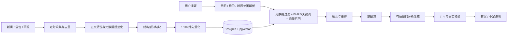

# 滚动时间窗投研 RAG 优化计划

## 1. 目标与约束

目标是在现有 Investment Research Agent 上建设一个可追踪、可评测、可恢复的“滚动时间窗”投研知识库：定时采集新闻、公告和研报，完成规范化、切块、向量化和元数据入库；问答时先识别意图与标的，再做时间过滤、关键词与向量混合检索，最后严格依据证据生成结论和引用。

已确定的边界：

- 单用户系统，不在本轮增加多租户隔离。
- 基础设施使用 PostgreSQL + pgvector、Redis + BullMQ。
- 默认检索最近 7 天的热数据，保留 180 天可检索归档；用户明确要求历史资料时再扩窗。
- 生产 embedding 走 OpenAI-compatible 接口，统一 1536 维；deterministic 只用于 test/mock 和本地演示。
- 后续采集计划为每 30 分钟增量抓取、每日一次对账补漏。
- 全部改造分成 7 个步骤。每一步单独实施、单独验收；上一步未验收，不进入下一步。

## 2. 目标链路



## 3. 分步实施与验收

### 步骤 1：工程质量、数据库与运行基础设施基线

目的：先建立后续所有 RAG 改动共同依赖的可复现底座，消除“代码能跑但数据库不可重建、checkpoint 未初始化、健康检查只探端口”等风险。

主要改造：

- 修复 TypeScript、ESLint、测试和构建基线，建立统一 `pnpm verify` 门禁。
- 补齐从空 PostgreSQL 数据库可完整重建的初始 migration，启用 pgvector，并将 `RagChunk.embedding` 固定为 `vector(1536)`。
- 增加幂等 `db:bootstrap`：先执行 migration deploy，再执行 LangGraph Postgres checkpointer setup，最后检查真实结构。
- 增加受保护的旧库 adoption：必须显式确认已备份，并验证核心表、pgvector 和向量维度；不符合条件即拒绝标记 migration。
- 把 LangGraph checkpointer 调整为按连接串复用、首次使用前 setup、进程退出时释放。
- readiness 覆盖数据库查询、migration、pgvector、checkpoint 表、Redis PING 和有 TTL 的 worker heartbeat；失败返回 HTTP 503。
- Docker Compose 使用一次性 `db-init`，web/worker 只在初始化成功且依赖健康后启动，不再运行 `db push`。
- 增加 CI 与基础设施契约测试；保护工作区中用户已有 UI/Pet 修改。

改动文件：

- `prisma/schema.prisma`
- `prisma/migrations/20260724000000_initial_schema/migration.sql`
- `prisma/migrations/20260803000000_rag_audit_pgvector/migration.sql`
- `prisma/migrations/20260908000000_rag_chunk_embedding_1536/migration.sql`
- `prisma/migrations/migration_lock.toml`
- `scripts/db-bootstrap.ts`
- `scripts/db-adopt.ts`
- `scripts/db-infra.ts`
- `scripts/check-infra.ts`
- `src/agents/checkpointer.ts`
- `src/agents/langgraph-runtime.ts`
- `src/agents/worker.ts`
- `src/lib/infra-readiness.ts`
- `src/app/api/agent-health/route.ts`
- `vitest.infra.config.ts`
- `docker-compose.yml`
- `.env.example`
- `.github/workflows/ci.yml`
- `README.md`、`package.json`、`pnpm-lock.yaml` 以及对应测试文件

验收矩阵：

| 验收项 | 命令或场景 | 通过标准 | 当前状态 |
| --- | --- | --- | --- |
| 静态质量 | `pnpm typecheck`、`pnpm lint` | 均退出 0 | 已通过（2026-09-08） |
| 自动化测试 | `pnpm test` | 全部测试通过 | 已通过：44 个应用测试文件、192 个用例；4 个 infra 测试文件、18 个用例（2026-09-08） |
| 生产构建 | `pnpm build` | 构建退出 0 | 已通过（2026-09-08） |
| Prisma 契约 | `pnpm exec prisma validate` | schema 合法 | 已通过（2026-09-08） |
| Compose 契约 | `docker compose config --quiet` | 配置解析成功且不泄露配置值 | 已通过（2026-09-08） |
| 空库初始化 | 新建隔离数据库后连续执行两次 `pnpm db:bootstrap` | 两次均成功，migration、pgvector、1536 维列和 checkpoint 表齐全 | 已通过：隔离 pgvector/Postgres 首次应用 4 条 migration，第二次无待执行项（2026-09-08） |
| 旧库 adoption 安全 | 无确认、缺表、无扩展、维度不符、已有 migration 表等用例 | 全部拒绝；仅合格旧库可显式 adoption | 已通过：bootstrap 对无 migration 账本的非空库在 Prisma 写入前拒绝；合格临时旧库只 baseline 前三条 migration，最终维度 migration 真实执行；现有库 3 条 64 维向量被识别并拒绝，数据未改（2026-09-08） |
| checkpoint 恢复 | 写入后关闭连接，再使用同一 thread 恢复 | 状态可从 PostgreSQL checkpoint 连续恢复 | 已通过：bootstrap 在关闭并重新建立 PostgresSaver 后读取并清理同一 thread checkpoint（2026-09-08） |
| readiness 负向场景 | 分别停 DB、Redis、worker 或缺 migration/checkpoint | 对应 check 失败且接口返回 503 | 已通过：在线 HTTP 200；Worker 优雅退出后 HTTP 503；隔离 Redis/DB 停止后对应检查真实失败；缺 migration/checkpoint 由现有旧库只读检查与契约测试验证（2026-09-08） |
| 回归保护 | 对比执行前后 dirty 文件与测试 | 用户已有 UI/Pet 改动未被覆盖 | 已核对：既有 UI/Pet 文件仍在工作区，相关测试通过；未重置、暂存或提交 |

步骤 1 验收结论（2026-09-08）：工程实现、隔离真实基础设施和正负向 readiness 验收通过，未进入步骤 2。当前开发库属于未受 migration 管理的旧库，3 条非空向量均为 64 维；安全守卫已确认会在任何 migration 写入前拒绝，原数据保持不变。若要让这份旧库切换到新基线，必须另行确认备份与 1536 维重嵌入或显式清理方案，该数据迁移动作不包含在本次自动验收中。

步骤 1 完成定义：上述可在当前环境运行的门禁全部通过；需要真实容器/服务的项目提供可重复脚本并完成实际验证，若环境不可用则明确保留为未验收。无论实现状态如何，本步骤都要等待用户明确验收后才能开始步骤 2。

### 步骤 2：文档、切块与时间元数据模型

目的：让所有来源以同一套可过滤、可追溯、可版本化的数据契约进入知识库。

技术实现：

- 设计 source document、document version、chunk、ingestion run 和 source cursor 的边界。
- 统一 `publishedAt`、`capturedAt`、`effectiveAt`、`expiresAt`、来源类型、来源 URL、股票代码、行业、主题、语言、授权状态、内容哈希和版本哈希。
- 对重复转载使用规范 URL、来源优先级、标题/正文指纹进行归并；保留原始来源映射，不直接丢证据链。
- 建立 7 天热窗与 180 天归档字段/索引，明确自然日与交易日口径、时区和缺失发布时间的降级规则。

预计改动：`prisma/schema.prisma`、新增 migration、`src/rag/types.ts`、`src/rag/metadata.ts`、`src/lib/repositories.ts` 及对应测试。

独立验收：schema/migration 可回放；三类来源 fixture 可无损映射；时间边界、重复文档、版本更新、授权和下架规则测试通过；不实施真实采集与检索。

### 步骤 3：证据契约与有据生成基线

目的：在扩大知识库前，先保证模型只能使用可核验证据，并在证据不足时明确降级。

技术实现：

- 定义统一 evidence packet：chunk、原文定位、来源、发布时间、标的、检索分数、证据等级和授权信息。
- 将事实型 claim 与 evidence ID 绑定；禁止引用不存在的证据，禁止把模型常识伪装为近期事实。
- 按公告、研报、主流新闻、转载等来源建立可配置等级；冲突证据并列呈现并说明时间与来源差异。
- 校验数值、日期、评级、机构和强结论；证据为空或不足时输出可解释的 evidence gap。

预计改动：`src/agents/executor.ts`、`src/agents/claim-verifier.ts`、`src/agents/evidence-grading.ts`、`src/agents/graph/nodes.ts`、`src/agents/types.ts`、`src/lib/repositories.ts` 及测试。

独立验收：无证据、矛盾证据、过期证据、错误引用和充分证据五类固定用例通过；每个可验证 claim 都能追溯到 evidence ID；不实施新采集管道。

### 步骤 4：结构感知切块与生产向量化

目的：针对新闻、公告和研报使用不同切块策略，并稳定生成可检索的 1536 维向量。

局部实施记录（2026-09-08，待用户单独验收）：用户在步骤 1 后另行明确授权了“切块策略”这一子项，因此已将原固定字符滑窗替换为确定性的 `structure-aware-v1`：支持 `generic/news/announcement/research-report` 四类配置，优先识别章节、段落和完整中英文句末，只有没有自然边界的超长文本才按字符兜底；当最后一个分块过短时会扩大末块重叠，避免产生无上下文的小尾块。系统保存与切块器一致的规范化正文，Chunk 元数据记录文档类型、策略版本、章节、可直接回切 `document.content` 的字符位置、字符数和内容哈希，章节标题同时参与向量文本与关键词重排。Embedding 在写入前校验返回数量、声明维度和有限数值；文档记录、旧 Chunk 清理、新 Chunk 及其 pgvector 写入在同一事务中完成，写入异常会显式失败并回滚。该记录不代表步骤 2、步骤 3或完整步骤 4 已完成；现有数据库未重切、未删除、未重嵌入。

代码级验收证据（2026-09-08）：结构切块、RAG 服务、Prisma 事务、API 和 Tool 的定向测试全部通过；`pnpm verify` 全量通过，其中应用测试 48 个文件/220 项、基础设施契约测试 4 个文件/18 项，并完成 TypeScript、ESLint 与 Next.js 生产构建。该验收未连接真实 pgvector 数据库，也未对现有数据执行写操作；独立只读复核确认本轮事务、偏移、向量校验、错误传播、标题检索与短尾处理均已闭环。

本步骤仍未实施的范围：稳定的外部文档身份与 `versionId` 版本模型、PDF 页码、复杂表格结构、模型 tokenizer 的精确 `tokenCount`、Embedding 批处理状态/重试/限流、正式模型重嵌入及真实 `vector(1536)` 读写验收。语义完整的短章节仍允许低于目标最小长度，且不会为了凑长度跨章节拼接。

技术实现：

- 先清洗正文与保留标题层级、表格说明、页码/段落定位，再按文档类型切块。
- 新闻以标题、导语、段落为单位，目标 350–600 中文字，重叠 60–100 字；公告按章节/条款/表格切，目标 500–900 字；研报按标题层级、摘要、观点、盈利预测、风险提示切，目标 700–1200 字。超过上限时按句子二次切分，不跨章节硬拼。
- 每个 chunk 保存 `documentId/versionId/chunkIndex/heading/pageStart/pageEnd/charStart/charEnd/tokenCount/contentHash` 及步骤 2 元数据。
- embedding 客户端支持批量、超时、指数退避、限流、失败重试、维度断言和幂等写入；模型或维度变化必须走版本化重嵌入。
- 批处理状态区分 pending/embedded/failed，失败不让整批静默成功。

预计改动：拆分 `src/rag/local-rag.ts`，新增 `src/rag/chunkers/*`、`src/rag/embeddings/*`、`src/rag/ingest-service.ts`，更新 `scripts/rag-ingest.ts` 与测试。

独立验收：黄金文档切块快照通过；标题/表格/页码不丢失；同文档重复 ingest 幂等；错误维度与部分批次失败可观测且可重试；数据库实际写入/读取 `vector(1536)` 成功。

### 步骤 5：滚动采集、去重与生命周期

目的：形成最近 7 天持续更新、180 天可追溯的稳定内容供给。

技术实现：

- 为新闻、公告、研报实现统一 source adapter 与 cursor；API、RSS、文件或授权数据源只负责拉取，规范化由公共管道完成。
- BullMQ 增加增量采集、正文处理、embedding、每日 reconciliation 和清理/归档任务；失败重试采用指数退避与死信/人工重放入口。
- 每 30 分钟抓取 `[lastSuccessfulCursor, now]` 并保留安全重叠，使用外部 ID + 内容哈希幂等；每日按日期和来源对账补漏。
- 查询默认过滤 `publishedAt >= now - 7d`；7–180 天标为 archive，超过 180 天按授权/保留策略软删除或冷存，不直接破坏引用历史。
- 记录每次 ingestion run 的抓取数、去重数、成功数、失败数、延迟和 cursor。

预计改动：新增 `src/ingestion/*`、采集队列与 worker、调度入口、对应 schema/migration、环境变量和集成测试。

独立验收：模拟跨窗、迟到、重复、来源修订、断点重跑和每日补漏；无重复 chunk，无游标丢数；热窗/归档转换正确；本步骤只证明数据管道，不评估检索质量。

### 步骤 6：意图解析与混合检索

目的：用股票、行业、主题和时间约束缩小候选集，再融合关键词与语义相似度，提升真实问题的召回与排序。

技术实现：

- 从问题提取意图、股票代码/别名、行业、主题、时间范围、文档类型；无法确定时保留多个候选或请求澄清。
- 默认时间窗为最近 7 天；“历史、过去一个月、某季度”等明确表达覆盖默认值，但最多自动查 180 天。
- PostgreSQL 侧先做授权、状态、时间和实体过滤；分别取 pgvector cosine Top-K 与 PostgreSQL FTS/关键词 Top-K。
- 用 Reciprocal Rank Fusion 合并候选，再按实体命中、标题命中、来源等级、时效衰减和多样性重排；同文档相邻块合并，控制单一来源占比。
- 返回分数分解、过滤条件和拒绝原因，便于调试与离线评测。

预计改动：`src/agents/entity-resolver.ts`、`src/agents/intent-planner.ts`、拆分后的 `src/rag/retrieval/*`、相关 SQL 索引/migration、RAG API 和测试。

独立验收：构建带相关/不相关标注的 query 集，报告 Recall@K、MRR、nDCG@K 和过滤正确率；股票同名、跨行业、日期边界、关键词稀有词及语义改写均有覆盖；不接最终 UI。

### 步骤 7：引用体验、评测、可观测性与灰度切换

目的：把完整 RAG 链路安全接入用户问答，并用指标持续判断是否优于现状。

技术实现：

- 答案按观点—证据—风险组织，展示来源、标题、发布日期、原文链接和可定位片段；清楚标注“近 7 天”或扩展历史范围。
- 建立检索层与生成层双重评测：Recall@K、Precision@K、MRR、nDCG、citation precision/recall、faithfulness、时效正确率、无答案准确率和端到端延迟。
- 固定离线黄金集并保存评测版本；线上记录 query、解析条件、候选、最终证据、模型调用、反馈和耗时，不记录不必要的敏感原文。
- 用 feature flag / shadow 模式对比旧链路和新链路；达到阈值后逐步切流，可一键回退。
- 面板监控采集延迟、失败率、热窗覆盖、空召回率、低证据回答率、引用错误率、P95 延迟和成本。

预计改动：`src/agents/graph/nodes.ts`、`src/agents/executor.ts`、`src/eval/*`、`scripts/run-eval.ts`、RAG/Agent API、引用 UI 组件、运行指标与文档。

独立验收：离线黄金集达到预先冻结的阈值；引用可点击且定位正确；关键线上指标可观测；shadow 对比无阻断问题；回退演练成功后，才允许替换现有问答链路。

## 4. 召回率口径

召回率用于衡量“应当找出的相关证据，有多少进入了候选结果”。先为每条测试问题人工标注相关 chunk/document 集合 `Relevant(q)`，系统返回前 K 个结果 `Retrieved@K(q)`：

```text
Recall@K(q) = |Relevant(q) ∩ Retrieved@K(q)| / |Relevant(q)|
```

总体可同时报告宏平均（每个问题等权）与微平均（所有相关证据等权）。若标注粒度是 document，而结果是 chunk，则先把 chunk 映射到 document 再计算 document Recall@K；不能混用两种粒度。只有一个标准答案时还应报告 Hit@K；排序质量配合 MRR/nDCG，避免“召回了但排得太后”被 Recall 掩盖。

## 5. 实施控制

- 步骤 1 已完成工程与隔离基础设施验收；此外仅实施了用户另行明确授权的步骤 4“切块策略”子项。步骤 2、步骤 3及步骤 4其余范围、步骤 5–7仍是冻结的后续工作，不得据此越过逐步验收。
- 每步开始前复核前一步验收证据，并检查工作区已有修改，禁止覆盖用户改动。
- 每步结束时更新本文件的验收矩阵，列出实际命令、结果、受限项和剩余风险。
- 涉及生产数据库的 adoption、重嵌入、归档或清理，必须先验证备份与回退路径。
- 任何未动态验证的能力只能标记为“待验收”或“受环境限制”，不能用静态检查替代并声称通过。
