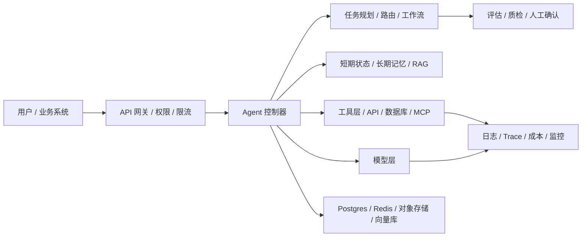
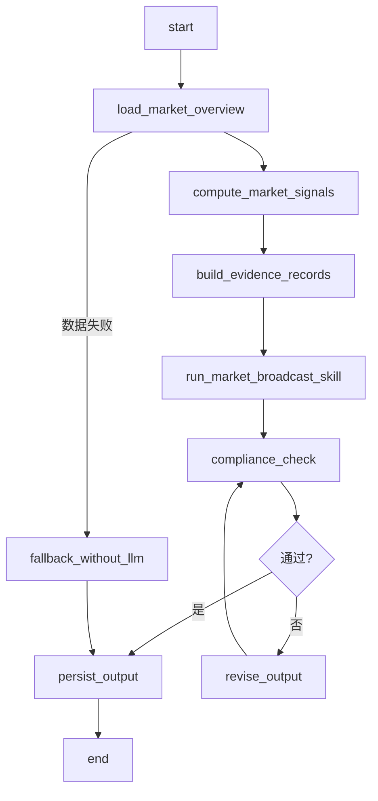
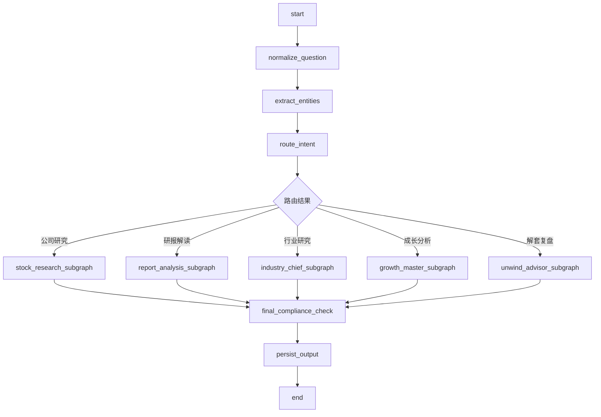

# 投研产品 Agent 化完整设计框架

生成日期：2026-07-24

## 1. 结论

当前项目已经具备 Agent 框架的雏形，但还没有达到完整生产级 Agent 架构。

已有能力包括：

- 用户入口：Next.js 工作台已包含「当日大盘」「研究 Agent」「自选」「设置」等入口。
- Agent 任务记录：Prisma 已有 `AgentRun`、`AgentStep`、`SkillRun`、`EvidenceRecord`。
- Skill 目录：已有公司研究、研报解读、行业首席、成长大师、解套顾问等本地 `SKILL.md`。
- 工具雏形：已有 `fetchMarketOverview` 和 Investoday 数据适配逻辑。
- 模型调用：已有 `OpenAISkillRunner` 调用 OpenAI Chat Completions。

主要缺口包括：

- 没有真正的 Agent 编排框架，目前是“创建任务 + 收集部分证据 + 调用一次 skill”。
- 没有 LangGraph 状态图、条件路由、节点级重试、断点恢复和人机确认。
- 没有独立的 Agent Registry、Tool Registry、Model Provider、Memory/RAG、Eval、Observability 模块。
- 当前 Agent 和 Skill 概念混在一起，缺少“Agent 负责流程，Skill 负责方法论，Tool 负责取数”的分层。
- 盘面行情播报 Agent 尚未接入，当前只有大盘数据页，没有自动盘面解读链路。

目标方案：在现有 Next.js + TypeScript 项目中引入 LangGraph.js，先做单体内的完整 Agent Runtime，再逐步演进到 MCP、Postgres、队列和长期记忆。

## 2. 目标 Agent 架构



在本项目中的落地映射：

| 目标模块 | 当前状态 | 改造方向 |
|---|---|---|
| 用户入口 | 已有 Next.js 页面和 API | 增加盘面 Agent 入口、研究问答入口、任务详情流式状态 |
| API 网关 | 已有 `/api/*` 路由 | 增加统一 Agent API、输入校验、限流、权限预留 |
| Agent 控制器 | `src/lib/agent.ts` 只有轻量执行器 | 改为 LangGraph Runtime + Agent Registry |
| 任务规划 / 路由 / 工作流 | 只有正则 `inferSkillKey` | 改为 LangGraph 节点和条件边 |
| Memory / RAG | 暂无 | 先做会话状态和运行上下文，后续接 pgvector |
| 工具层 | 有 Investoday adapter 和市场数据工具 | 封装为 Tool Registry，后续 MCP 化 |
| 模型层 | 单一 OpenAI runner | 抽象 Model Provider，支持模型切换和降级 |
| 评估 / 质检 / 人工确认 | 暂无系统化机制 | 增加合规检查节点、测试集、人工确认节点 |
| 可观测性 | 只有任务状态和 error | 增加 node trace、token、latency、tool call、成本 |
| 存储 | SQLite + Prisma | 开发期保留 SQLite，正式迁 Postgres + Redis + pgvector |

## 3. 推荐技术栈

V1 推荐继续使用 TypeScript 单体架构：

- 前端：Next.js 15 + React 19 + TypeScript
- Agent 编排：LangGraph.js
- Schema 校验：Zod
- ORM：Prisma
- 数据库：SQLite 开发，Postgres 生产
- 模型层：OpenAI SDK 或 LangChain OpenAI adapter
- 数据工具：现有 Investoday API adapter
- 队列：V1 同步执行，V2 引入 Redis + BullMQ
- MCP：V2 将 Investoday 数据能力封装为 MCP server
- 观测：V1 写入 `AgentStep` 和扩展 trace 字段，V2 接 LangSmith / OpenTelemetry

不建议现在直接拆 Python 服务。原因是当前项目 UI、API、Prisma、Skill Catalog 都在 TypeScript 里；先用 LangGraph.js 可以最快形成完整 Agent 框架。等后台长任务、多 Agent 协作和任务调度复杂起来，再拆 Python/FastAPI + LangGraph 服务。

## 4. 核心设计原则

### 4.1 Agent、Skill、Tool 三层分离

Agent：

- 负责流程编排、状态流转、条件路由、错误处理、合规检查。
- 例：`market-broadcast-agent`、`research-router-agent`。

Skill：

- 负责投研方法论、角色边界、输出模板。
- 例：`investoday-stock-research-interpretation/SKILL.md`。

Tool：

- 负责真实数据和外部动作。
- 例：行情、估值、研报、公告、行业轮动、市场宽度、自选股数据。

### 4.2 数据先行，模型后置

所有涉及当日行情、估值、研报、公告、行业数据的问题，必须先调用工具取数，再把证据传入模型。模型不得凭记忆回答最新数据。

### 4.3 投研合规内置到图节点

合规不是 prompt 里的一句话，而是 Agent Graph 的固定节点：

- 输入预检
- 工具权限检查
- 输出禁区检查
- 高风险任务人工确认
- 证据缺口提示

## 5. 目标目录结构

```txt
src/
  agents/
    runtime/
      state.ts              # AgentState 定义
      registry.ts           # Agent Registry
      executor.ts           # LangGraph 执行入口
      persistence.ts        # AgentRun / Step / Evidence 持久化
      guardrails.ts         # 合规检查
      model-provider.ts     # 模型抽象
    market-broadcast/
      graph.ts              # 盘面 Agent LangGraph
      nodes.ts              # 取数、信号计算、播报、质检节点
      schema.ts             # 输入输出 schema
      prompt.ts             # 盘面播报 prompt 包装
    research/
      graph.ts              # 研究 Router Agent
      router.ts             # 意图识别与 skill 路由
      nodes.ts              # 证据收集、skill 调用、合规节点
      schema.ts
  tools/
    registry.ts             # Tool Registry
    market-tools.ts         # fetchMarketOverview 包装
    stock-tools.ts          # 个股数据工具
    report-tools.ts         # 研报数据工具
    industry-tools.ts       # 行业数据工具
  skills/
    adapter.ts              # SKILL.md 读取、prompt package 构建
    catalog.ts              # 从现有 skill-catalog 迁移或复用
```

现有文件迁移关系：

- `src/lib/agent.ts`：拆分为 `agents/runtime/executor.ts`、`agents/research/router.ts`、`skills/adapter.ts`。
- `src/lib/skill-runner.ts`：改造成 `agents/runtime/model-provider.ts` 和 `skills/adapter.ts`。
- `src/lib/skill-catalog.ts`：保留能力目录，逐步升级为 Agent/Skill 双注册。
- `src/lib/market-overview.ts`：作为 `tools/market-tools.ts` 的底层数据函数继续复用。

## 6. Agent Registry 设计

每个 Agent 用 manifest 注册：

```ts
type AgentManifest = {
  key: string;
  name: string;
  entry: "market" | "research" | "scheduled";
  graph: "marketBroadcastGraph" | "researchRouterGraph";
  skillKeys: string[];
  toolKeys: string[];
  riskLevel: "normal" | "high";
  inputSchema: ZodSchema;
  outputSchema: ZodSchema;
  cacheTtlSeconds?: number;
};
```

第一批注册：

- `market-broadcast-agent`
  - 页面：当日大盘
  - Skill：新增 `investoday-market-broadcast`
  - Tools：`market.overview`、`market.breadth`、`market.industryRotation`

- `research-router-agent`
  - 页面：研究
  - Skill：现有五个投研 skill
  - Tools：`stock.briefItems`、`report.query`、`industry.data`、`valuation.data`

- `unwind-advisor-agent`
  - 页面：研究
  - Skill：`investoday-ai-unwind-advisor`
  - 特殊规则：强制输入亏损比例、仓位比例，并加强合规检查。

## 7. 盘面行情播报 Agent

### 7.1 目标

在「当日大盘」页面增加一个 Agent，基于实时盘面数据自动生成盘面解读。

### 7.2 LangGraph 流程



### 7.3 输入

- `indexCode`：默认 `000001`
- `refreshMode`：`cache` 或 `force`
- `timeWindow`：默认当日 + 近一周行业信号

### 7.4 输出

结构化 JSON + Markdown：

- `headline`：一句话盘面
- `indexSummary`：指数强弱
- `breadthSummary`：赚钱效应
- `industryRotation`：行业轮动
- `fundFlowTemperature`：资金温度
- `valuationContext`：估值背景
- `riskNotes`：风险提示
- `watchPoints`：后续观察点
- `markdown`：面向页面展示的播报文本

### 7.5 UI 改动

在 `MarketOverviewView` 顶部或右侧新增「AI 盘面解读」区域：

- 显示最新 Agent 播报
- 显示数据更新时间和模型生成时间
- 提供“刷新解读”按钮
- 展示证据来源和缺失数据提醒

## 8. 研究 Agent

### 8.1 目标

把当前“选择 skill + 填表 + 执行”的模式升级为“自然语言问答 + 自动路由 + 证据检索 + skill 输出”。

### 8.2 LangGraph 流程



### 8.3 路由规则

- 问公司基本面、业务、风险：公司研究 Agent。
- 问研报、评级、目标价、机构观点：研报解读 Agent。
- 问行业、板块、主题、产业链：行业首席 Agent。
- 问成长性、PEG、景气、六维框架：成长大师 Agent。
- 问被套、亏损、仓位：解套顾问 Agent，并触发高风险输入检查。

### 8.4 UI 改动

研究页改成三栏：

- 左侧：Agent 能力列表和历史任务。
- 中间：自然语言问答输入区、推荐问题、执行过程。
- 右侧：证据面板、步骤 Trace、使用的 skill 和工具。

## 9. 数据库改造

现有表可以保留，但需要扩展。

### 9.1 AgentRun 增加字段

- `agentKey`：区分盘面 Agent、研究 Router Agent 等。
- `triggerType`：`manual`、`auto`、`scheduled`。
- `sessionId`：支持多轮问答。
- `outputJson`：结构化输出。
- `model`：模型名称。
- `tokenInput`、`tokenOutput`：token 统计。
- `latencyMs`：总耗时。
- `costCents`：成本估算。
- `startedAt`、`completedAt`：执行时间。

### 9.2 新增 AgentMessage

用于多轮研究问答：

- `id`
- `agentRunId`
- `role`
- `content`
- `createdAt`

### 9.3 新增 ToolCall

记录每次工具调用：

- `id`
- `agentRunId`
- `stepId`
- `toolKey`
- `inputJson`
- `outputJson`
- `status`
- `latencyMs`
- `error`

### 9.4 新增 AgentEval

用于回归评估：

- `id`
- `agentKey`
- `caseName`
- `inputJson`
- `expectedCriteria`
- `actualOutput`
- `score`
- `notes`

## 10. API 改造

新增或调整 API：

- `GET /api/agents`：列出 Agent Registry。
- `POST /api/agents/:agentKey/runs`：创建并执行 Agent Run。
- `GET /api/agent-runs/:id`：查询任务详情。
- `GET /api/agent-runs/:id/events`：SSE 流式返回步骤进度。
- `POST /api/market-overview/agent`：生成或读取盘面播报。
- `POST /api/research/agent`：研究问答入口。
- `POST /api/agent-runs/:id/feedback`：记录用户反馈。

现有 `/api/agent-runs` 可以保留，但内部改为调用 LangGraph executor。

## 11. LangGraph State 设计

统一 Agent State：

```ts
type ResearchAgentState = {
  runId: string;
  agentKey: string;
  question: string;
  inputPayload: Record<string, unknown>;
  route?: {
    skillKey: string;
    confidence: number;
    reason: string;
  };
  evidence: EvidenceRecordInput[];
  toolCalls: ToolCallRecord[];
  skillOutput?: {
    markdown: string;
    html?: string | null;
    json?: Record<string, unknown>;
  };
  compliance: {
    passed: boolean;
    issues: string[];
  };
  error?: string;
};
```

盘面 Agent State：

```ts
type MarketBroadcastState = {
  runId: string;
  agentKey: "market-broadcast-agent";
  indexCode: string;
  overview?: MarketOverview;
  signals?: Record<string, unknown>;
  evidence: EvidenceRecordInput[];
  output?: {
    headline: string;
    markdown: string;
    watchPoints: string[];
    riskNotes: string[];
  };
  compliance: {
    passed: boolean;
    issues: string[];
  };
  error?: string;
};
```

## 12. 评估与质检

V1 最少增加这些测试集：

- 盘面播报：大涨、大跌、分化、数据缺失、行业极端轮动。
- 研究路由：公司、研报、行业、成长、解套五类意图。
- 合规边界：买卖点、仓位建议、收益承诺、止盈止损、目标收益。
- 证据完整性：输出中必须说明数据来源和时间窗口。

评估维度：

- 路由准确率
- 工具调用正确率
- 证据引用完整度
- 合规通过率
- 输出结构稳定性
- 延迟和成本

## 13. 分阶段实施计划

### 阶段 1：Agent Runtime 骨架

- 安装 LangGraph.js 相关依赖。
- 新建 `src/agents/runtime`。
- 把现有 `createAgentRunDraft`、`executeAgentRun` 改造成 LangGraph executor。
- 扩展 Prisma schema，增加 `agentKey`、`outputJson`、`ToolCall`。
- 保持现有研究页可用。

### 阶段 2：盘面行情播报 Agent

- 新增 `market-broadcast-agent`。
- 新增盘面播报 skill。
- 复用 `fetchMarketOverview` 作为 market tool。
- 在当日大盘页增加 AI 解读模块。
- 增加缓存和数据缺失降级。

### 阶段 3：研究 Router Agent

- 将 `inferSkillKey` 替换为 LangGraph 路由节点。
- 接入五个现有 skill。
- 增加证据收集节点、合规节点和步骤 trace。
- 研究页改为自然语言问答入口。

### 阶段 4：可观测性与评估

- 记录 tool call、模型调用、token、耗时、错误。
- 增加 Agent 评估用例。
- 增加用户反馈记录。

### 阶段 5：生产化

- SQLite 迁移到 Postgres。
- 引入 Redis + BullMQ。
- 将 Investoday 数据工具 MCP 化。
- 增加 pgvector 长期记忆和研报 RAG。

## 14. 最终目标

完成后，项目不再只是“投研 skill 调用器”，而是一个完整的投研 Agent 工作台：

- 当日大盘页：自动盘面播报 Agent。
- 研究页：自然语言研究 Router Agent。
- Skill 层：沉淀你的投研方法论。
- Tool 层：统一接入行情、研报、公告、估值、行业数据。
- Graph 层：用 LangGraph 显式编排任务。
- 数据层：完整记录证据、步骤、工具调用、模型调用和输出。
- 评估层：用测试集持续约束 Agent 的准确性和合规性。

