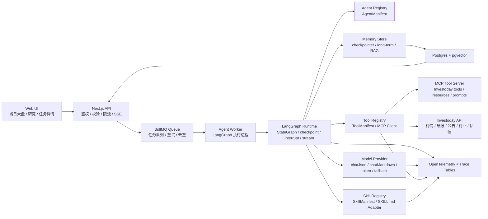
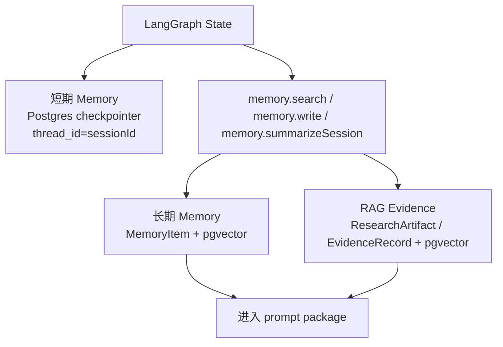
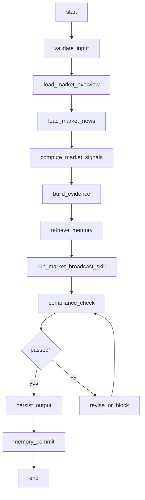
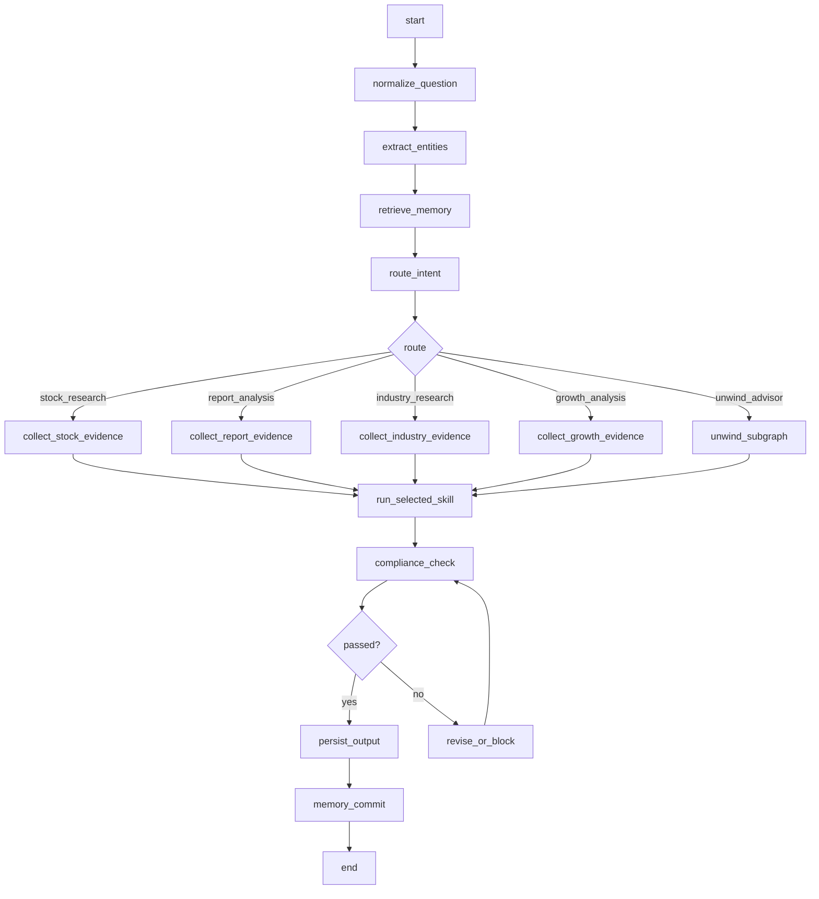

# 投研产品 Agent 化正式可实施架构方案

生成日期：2026-07-25  
目标：把当前投研工作台升级为可长期运行、可审计、可扩展、可评估的正式 Agent 系统。

## 1. 总体结论

当前项目已经具备 Agent 化基础：Next.js 工作台、Prisma 数据模型、`AgentRun`/`SkillRun`/`EvidenceRecord`、本地 `SKILL.md` 目录、已完善的 `skills/investoday-stock-market-broadcast/` 盘面行情播报 skill、Investoday 数据适配器、当日大盘数据页和研究 Agent 页。下一步不是继续堆单次 LLM 调用，而是重构为完整的 Agent Runtime。

目标架构直接采用：

```txt
Next.js Web/API
  + LangGraph.js Agent Runtime
  + BullMQ/Redis Agent Worker
  + Postgres/pgvector
  + MCP Tool Server
  + OpenTelemetry
```

核心原则：

- Web UI 只负责交互、展示、SSE 进度和人工确认。
- Next.js API 负责鉴权、输入校验、任务创建、任务查询、反馈写入。
- Agent Worker 负责执行 LangGraph，不在 HTTP 请求生命周期内跑长任务。
- LangGraph 负责状态图、条件路由、节点重试、短期状态、人工中断和恢复。
- Tool Registry 统一管理 Investoday、数据库、Memory、MCP、Skill 调用。
- Skill Registry 管理所有投研 `SKILL.md`，Skill 只表达方法论和输出规范，不直接取数。
- Memory Store 负责短期任务状态、长期用户偏好、研究沉淀和 RAG 检索。
- 所有模型调用、工具调用、证据、输出、合规检查和成本必须可追踪、可回放、可评估。

官方依据：

- LangGraph JS：低层 Agent 编排运行时，支持长期、带状态的 Agent、持久化、流式输出和 human-in-the-loop。参考 [LangGraph overview](https://docs.langchain.com/oss/javascript/langgraph/overview)。
- LangGraph Persistence：用 checkpointer 做线程级短期状态，用 store 做跨线程长期记忆。参考 [LangGraph persistence](https://docs.langchain.com/oss/javascript/langgraph/persistence)。
- LangGraph Streaming：通过 `updates`、`values`、`messages`、`tools`、`debug` 等 stream mode 暴露执行状态和工具进度。参考 [LangGraph streaming](https://docs.langchain.com/oss/javascript/langgraph/streaming)。
- LangGraph Interrupts：用 `interrupt()` 暂停图执行，等待外部输入后通过 `Command` 恢复。参考 [LangGraph interrupts](https://docs.langchain.com/oss/javascript/langgraph/interrupts)。
- MCP TypeScript SDK：用于创建暴露 tools、resources、prompts 的 MCP server/client。参考 [MCP TypeScript SDK](https://ts.sdk.modelcontextprotocol.io/)。
- OpenTelemetry：用于生成、采集和导出 traces、metrics、logs。参考 [OpenTelemetry](https://opentelemetry.io/docs/what-is-opentelemetry/)。

## 2. 完整架构



### 2.1 进程职责

| 模块 | 职责 | 禁止事项 |
|---|---|---|
| Web UI | 输入问题、展示结果、订阅 SSE、处理人工确认 | 不直接调用模型，不直接调用数据工具 |
| Next.js API | 创建任务、鉴权校验、入队、查询、反馈、恢复中断 | 不执行长时间 Agent graph |
| Agent Worker | 消费队列、执行 LangGraph、落库 trace、发送事件 | 不处理 UI 状态 |
| LangGraph Runtime | 编排节点、维护状态、条件路由、checkpoint、interrupt | 不直接绕过 registry 调工具 |
| Tool Registry | 工具注册、权限、超时、重试、缓存、审计 | 不返回未标准化的大块原始数据给模型 |
| Skill Registry | 读取 SKILL.md、引用文件、模板、合规边界 | 不负责真实取数 |
| Memory Store | 短期状态、长期偏好、研究沉淀、RAG 检索 | 不保存无来源、不可解释的结论 |
| Model Provider | 模型调用、结构化输出、成本统计、降级 | 不决定业务路由 |

## 3. 目标目录结构

```txt
src/
  agents/
    runtime/
      state.ts
      registry.ts
      executor.ts
      queue.ts
      worker.ts
      persistence.ts
      events.ts
      guardrails.ts
      model-provider.ts
      observability.ts
    market-broadcast/
      graph.ts
      nodes.ts
      signals.ts
      schema.ts
      prompts.ts
    research/
      graph.ts
      router.ts
      nodes.ts
      schema.ts
    unwind/
      subgraph.ts
      schema.ts
  tools/
    registry.ts
    manifest.ts
    mcp-client.ts
    mcp-server.ts
    market-tools.ts
    stock-tools.ts
    report-tools.ts
    industry-tools.ts
    valuation-tools.ts
    news-tools.ts
    memory-tools.ts
  skills/
    registry.ts
    adapter.ts
    manifest.ts
    prompt-package.ts
  memory/
    store.ts
    embeddings.ts
    retrieval.ts
    summarizer.ts
  evals/
    cases.ts
    runner.ts
    scorers.ts
```

现有代码迁移关系：

- `src/lib/agent.ts` 拆为 `agents/runtime/executor.ts`、`agents/research/router.ts`、`skills/prompt-package.ts`。
- `src/lib/skill-runner.ts` 改为 `agents/runtime/model-provider.ts`，只保留模型调用能力。
- `src/lib/skill-catalog.ts` 改为 `skills/registry.ts`，同时新增 Agent/Skill 双注册。
- `src/lib/market-overview.ts` 作为 `tools/market-tools.ts` 的底层数据能力继续复用。
- `src/lib/investoday.ts` 作为 Tool Registry 和 MCP Server 的 Investoday 底层 adapter。
- `src/app/api/agent-runs/*` 保留兼容入口，内部改为调用统一 Agent API 和队列。

## 4. Agent Registry

Agent 是“流程编排单元”，每个 Agent 必须有 manifest。manifest 是系统可执行契约，不是展示文案。

```ts
type AgentManifest = {
  agentKey: string;
  name: string;
  entry: "market" | "research" | "scheduled";
  graphKey: "marketBroadcastGraph" | "researchRouterGraph";
  allowedToolKeys: string[];
  allowedSkillKeys: string[];
  riskLevel: "normal" | "high";
  supportsHitl: boolean;
  inputSchema: ZodSchema;
  outputSchema: ZodSchema;
  defaultModel: string;
  maxToolCalls: number;
  maxRetriesPerNode: number;
  timeoutMs: number;
};
```

首批 Agent：

| Agent | 页面入口 | Graph | Skills | Tools | 输出 |
|---|---|---|---|---|---|
| `market-broadcast-agent` | 当日大盘 | `marketBroadcastGraph` | `investoday-stock-market-broadcast` | `market.overview`、`market.changeRatioStatus`、`market.indexRealtime`、`news.market`、`memory.search` | 盘面播报 JSON + Markdown |
| `research-router-agent` | 研究 | `researchRouterGraph` | 公司研究、研报解读、行业首席、成长大师、解套顾问 | 股票、研报、行业、估值、公告、memory tools | 研究回答 JSON + Markdown |
| `unwind-advisor-subgraph` | 研究高风险路径 | `unwindSubgraph` | `investoday-ai-unwind-advisor` | `stock.briefItems`、`report.query`、`valuation.data`、`memory.search` | 解套复盘，不输出交易动作 |

`skills/investoday-stock-market-broadcast/` 已经是项目内完善版盘面行情播报 skill 包。Agent 化实施阶段不再复制、重写或重新设计该 skill，而是由 Skill Registry 直接读取 `skills/investoday-stock-market-broadcast/SKILL.md`，解析 front matter、依赖、合规边界和输出模板，再由 `market-broadcast-agent` 通过 Skill Adapter 调用。

## 5. LangGraph Runtime

### 5.1 统一 Agent State

所有 graph 使用统一基础状态，具体 Agent 扩展自己的字段。

```ts
type BaseAgentState = {
  runId: string;
  sessionId: string;
  agentKey: string;
  userId?: string;
  question: string;
  inputPayload: Record<string, unknown>;
  messages: Array<{ role: "user" | "assistant" | "system"; content: string }>;
  route?: {
    skillKey: string;
    confidence: number;
    reason: string;
    requiredInputs: string[];
    missingInputs: string[];
  };
  evidenceIds: string[];
  toolCallIds: string[];
  modelCallIds: string[];
  memoryItemIds: string[];
  skillRunIds: string[];
  outputJson?: Record<string, unknown>;
  outputMarkdown?: string;
  compliance: {
    passed: boolean;
    issues: string[];
    blockedTerms: string[];
    revised: boolean;
  };
  interrupt?: {
    type: "approval" | "missing_input" | "risk_confirm";
    payload: Record<string, unknown>;
  };
  error?: string;
};
```

### 5.2 执行规范

- 每个 HTTP 请求只创建 `AgentRun` 并入队。
- Worker 从 BullMQ 获取任务，载入 AgentManifest，编译对应 graph。
- Graph 执行时必须传入 `{ configurable: { thread_id: sessionId } }`。
- 所有节点开始、完成、失败都写入 `AgentStep` 和 OpenTelemetry span。
- 所有工具调用必须通过 Tool Registry。
- 所有模型调用必须通过 Model Provider。
- 所有 skill 调用必须通过 Skill Adapter。
- 高风险路径使用 LangGraph `interrupt()` 暂停，API 通过 `POST /api/agent-runs/[id]/resume` 恢复。

## 6. Memory 架构

Memory 分三层，不混用。



### 6.1 短期 Memory

用途：同一个会话或同一个 AgentRun 的 graph state、messages、route、evidence ids、tool call ids、interrupt 状态。

实现：

- 使用 LangGraph Postgres checkpointer。
- `thread_id = AgentSession.id`。
- `AgentSession` 保存用户、入口、标题、最近活动时间。
- `AgentMessage` 保存用户和 Agent 的多轮消息。
- graph state 只保存必要 id，不直接塞入超大原文。

### 6.2 长期 Memory

用途：跨会话记住用户研究偏好、常用观察框架、关注行业、历史研究结论摘要。

实现：

- `MemoryItem` 表保存 `scope`、`kind`、`content`、`sourceRunId`、`confidence`、`embedding`。
- `memory.write` 只能由 graph 的 `memory_commit` 节点调用。
- 写入前必须经过 `memory_summarize`，只保存稳定偏好或研究摘要，不保存临时噪声。
- `memory.search` 以 `userId + agentKey + question` 检索相关记忆，并把结果加入 prompt package 的「历史上下文」区。

### 6.3 RAG Memory

用途：研报、公告、新闻、市场数据、历史问答的证据检索。

实现：

- `EvidenceRecord` 保存单次 run 使用的证据。
- `ResearchArtifact` 保存可复用研究材料，如研报摘要、公告摘要、行业报告、历史 Agent 输出。
- 两者都生成 embedding 写入 pgvector。
- `memory.search` 负责查长期记忆，`artifact.search` 负责查研究材料，两者结果都必须带来源和时间。

## 7. Tool 架构

Tool 是 Agent 可执行能力。所有工具必须注册 manifest。

```ts
type ToolManifest = {
  toolKey: string;
  name: string;
  source: "local" | "mcp" | "database" | "memory" | "skill";
  inputSchema: ZodSchema;
  outputSchema: ZodSchema;
  permission: "read_public_market" | "read_user_data" | "write_memory" | "execute_skill";
  timeoutMs: number;
  retry: { maxAttempts: number; backoffMs: number };
  cache: { enabled: boolean; ttlSeconds?: number };
  audit: { persistInput: boolean; persistOutputSummary: boolean; persistRawPayload: boolean };
};
```

### 7.1 首批工具

| Tool | 来源 | 现有基础 | 用途 |
|---|---|---|---|
| `market.overview` | local + Investoday | `fetchMarketOverview` | 大盘指数、市场宽度、行业轮动、估值 |
| `market.changeRatioStatus` | MCP/Investoday | `market/change-ratio-status` | 市场涨跌家数、涨跌停、平盘家数和市场宽度 |
| `market.indexRealtime` | MCP/Investoday | `index-quote/realtime` | 上证指数、深证成指、创业板指、沪深300等宽基指数实时行情 |
| `stock.briefItems` | local + Investoday | `InvestodayDataAdapter.fetchBriefItems` | 个股新闻、公告、研报、情绪 |
| `report.query` | MCP/Investoday | 研报相关 skill data refs | 查询研报列表和研报详情 |
| `report.sentiment` | MCP/Investoday | `research/sentiment` | 研报舆情和机构观点 |
| `industry.data` | MCP/Investoday | 行业数据 skill data refs | 行业景气、估值、轮动、财务 |
| `valuation.data` | MCP/Investoday | 估值数据 skill data refs | 个股/行业估值 |
| `news.market` | MCP/Investoday | `news` | 市场主题、资讯催化、风险事件 |
| `memory.search` | database + pgvector | 新增 | 长期记忆和研究沉淀检索 |
| `memory.write` | database + pgvector | 新增 | 写入稳定偏好和研究摘要 |
| `skill.run` | local | `SKILL.md` + Model Provider | 调用 Skill Adapter |

### 7.2 Tool 执行规则

- Graph 节点只能通过 `ToolRegistry.call(toolKey, input, context)` 调工具。
- Tool Registry 负责 Zod 输入校验、权限检查、超时、重试、缓存、审计。
- 每次调用写入 `ToolCall`：`toolKey`、`inputJson`、`outputSummary`、`rawPayloadRef`、`status`、`latencyMs`、`error`、`sourceEndpoint`。
- 大型原始 payload 不直接写入 prompt；先标准化为 evidence summary，再由 evidence id 关联原始数据。
- MCP Server 暴露 Investoday tools/resources/prompts，Agent Worker 可直接调用本地 Tool Registry，也可通过 MCP Client 调远程工具。

## 8. Skill 架构

Skill 是投研方法论和输出规范，不是取数器。

```ts
type SkillManifest = {
  skillKey: string;
  name: string;
  skillPath: string;
  requiredReferences: string[];
  inputSchema: ZodSchema;
  outputSchema: ZodSchema;
  complianceRules: string[];
  outputType: "markdown" | "json_markdown" | "html_markdown";
  riskLevel: "normal" | "high";
};
```

### 8.1 注册的核心 Skill

| Skill | 用途 | 接入方式 |
|---|---|---|
| `investoday-stock-market-broadcast` | 盘面行情播报 | 已完善，路径 `skills/investoday-stock-market-broadcast/SKILL.md`，供 `market-broadcast-agent` 调用 |
| `investoday-stock-research-interpretation` | 公司研究 | 保留当前项目 skill |
| `investoday-research-report-analysis` | 研报解读 | 保留当前项目 skill |
| `investoday-industry-chief-analyst` | 行业研究 | 保留当前项目 skill |
| `gs-growth-master-strategy` | 成长分析 | 保留当前项目 skill |
| `investoday-ai-unwind-advisor` | 解套复盘 | 高风险 skill，必须走 interrupt 确认 |

### 8.2 Skill Adapter

Skill Adapter 负责：

- 读取 `SKILL.md`。
- 按 SkillManifest 读取必要 references、templates、合规边界。
- 接收 Agent 已经取好的 evidence、memory、route、inputPayload。
- 构造 prompt package：
  - 用户问题
  - 标准化输入
  - 路由意图
  - 证据清单
  - 记忆摘要
  - Skill 正文
  - 输出 schema
  - 合规规则
- 调用 Model Provider。
- 解析结构化输出。
- 交给合规节点做最终检查。

Skill 输出不得直接成为最终答案，必须通过 `compliance_check` 和 `persist_output` 节点。

### 8.3 盘面行情播报 Skill 接入契约

`skills/investoday-stock-market-broadcast/` 是当前项目内已完善的正式 skill 包，Skill Registry 必须按 production-ready skill 加载。

注册信息：

- `skillKey`: `investoday-stock-market-broadcast`
- `skillPath`: `skills/investoday-stock-market-broadcast/SKILL.md`
- `version`: 从 `SKILL.md` front matter 读取，当前 skill 包为 `1.4.1`
- `requires`: 从 front matter 的 `metadata.clawdbot.requires.skills` 读取，当前依赖 `investoday-finance-data`
- `riskLevel`: `normal`
- `outputType`: `json_markdown`

数据依赖：

| Skill 内数据需求 | Tool Registry 工具 | Investoday endpoint | 执行方式 |
|---|---|---|---|
| 市场涨跌分布 | `market.changeRatioStatus` | `market/change-ratio-status` | 与指数、新闻并行 |
| 主要指数实时行情 | `market.indexRealtime` | `index-quote/realtime` | 默认取 `000001`、`399001`、`399006`、`000300` |
| 市场资讯催化 | `news.market` | `news` | 默认取最近 24 小时、最多 10 条 |
| 当日大盘聚合视图 | `market.overview` | 本地聚合工具 | 复用现有 `fetchMarketOverview`，用于 UI 和 evidence 汇总 |

接入规则：

- Agent 节点先取数并写入 `EvidenceRecord`，再把 evidence package 交给 Skill Adapter。
- Skill Adapter 只负责读取 `SKILL.md`、组织 prompt package、调用 Model Provider、解析输出。
- 该 skill 的强约束必须进入 `guardrails.ts`：禁止买卖点、交易时机、仓位建议、目标价、止盈止损、支撑压力位操作依据和短线交易信号。
- 当用户要求交易动作时，graph 不切换到交易建议，而是保持盘面环境、风险因素、情景分析和后续观察指标四类输出。
- 每次调用必须生成 `SkillRun`、`ModelCall`、`ToolCall`、`EvidenceRecord` 和 `AgentStep`，保证页面可追踪数据来源、模型输入摘要和合规检查结果。

## 9. Model Provider

`OpenAISkillRunner` 改造为通用 Model Provider。

```ts
type ModelProvider = {
  chatJson(input: {
    model: string;
    system: string;
    user: string;
    schema: ZodSchema;
    temperature?: number;
    trace: ModelTraceContext;
  }): Promise<{ json: Record<string, unknown>; usage: TokenUsage }>;

  chatMarkdown(input: {
    model: string;
    system: string;
    user: string;
    temperature?: number;
    trace: ModelTraceContext;
  }): Promise<{ markdown: string; usage: TokenUsage }>;
};
```

执行规则：

- 每次模型调用写入 `ModelCall`。
- `ModelCall` 记录 model、prompt hash、token、latency、cost、status、error。
- 结构化任务优先使用 `chatJson`，展示文本使用 `chatMarkdown`。
- 模型失败后按 manifest 中的 fallback model 降级一次，降级也写入 `ModelCall`。
- 投研合规规则不只依赖模型，必须由 `guardrails.ts` 执行静态检查。

## 10. 两个首批 Agent

### 10.1 `market-broadcast-agent`

页面：当日大盘。  
目标：基于实时市场数据生成非操作性的盘面行情播报。绑定已完善 skill 包 `skills/investoday-stock-market-broadcast/`。



输入 schema：

```ts
type MarketBroadcastInput = {
  indexCode?: "000001" | "399001" | "399006" | "000300" | "000905" | "000852";
  sessionType?: "morning" | "midday" | "intraday" | "after_close" | "auto";
  question?: string;
};
```

输出 schema：

```ts
type MarketBroadcastOutput = {
  headline: string;
  marketStage: string;
  indexSummary: string;
  breadthSummary: string;
  industryRotation: string;
  fundFlowTemperature: string;
  valuationContext: string;
  riskNotes: string[];
  watchPoints: string[];
  evidenceIds: string[];
  markdown: string;
};
```

实施要点：

- `load_market_overview` 调 `market.overview`，底层复用 `fetchMarketOverview`，用于生成 UI 聚合视图和 evidence 摘要。
- `load_market_news` 调 `news.market`，对应 skill 中 `news` 数据依赖，补充市场主题、资讯催化和风险事件。
- 当需要复现 skill 原子数据链路时，`load_market_overview` 内部或并行节点必须调用 `market.changeRatioStatus` 和 `market.indexRealtime`，分别对应 `market/change-ratio-status` 与 `index-quote/realtime`。
- `compute_market_signals` 只做确定性计算，如上涨占比、极端波动比例、行业强弱排序、指数分化。
- `run_market_broadcast_skill` 通过 Skill Adapter 调项目内 `skills/investoday-stock-market-broadcast/SKILL.md`，传入标准化行情、新闻、市场阶段、memory 和 evidence ids。
- `compliance_check` 禁止买卖点、交易时机、仓位建议、目标价、止盈止损。
- UI 展示播报正文、证据来源、数据时间、AgentRun 状态和刷新按钮。

### 10.2 `research-router-agent`

页面：研究。  
目标：自然语言问答，自动路由到合适投研 skill，先取证据再回答。



路由规则：

| 意图 | skillKey | 必要工具 |
|---|---|---|
| 公司基本面、业务、风险 | `investoday-stock-research-interpretation` | `stock.briefItems`、`report.query`、`valuation.data` |
| 研报、评级、机构观点 | `investoday-research-report-analysis` | `report.query`、`report.sentiment` |
| 行业、板块、主题、产业链 | `investoday-industry-chief-analyst` | `industry.data`、`report.query`、`news.market` |
| 成长性、PEG、景气、六维框架 | `gs-growth-master-strategy` | `industry.data`、`valuation.data`、`report.query` |
| 被套、亏损、仓位 | `investoday-ai-unwind-advisor` | `stock.briefItems`、`report.query`、`valuation.data` |

高风险 `unwind_advisor` 子路径：

- 缺少 `stockCode`、`lossPercent`、`positionPercent` 时触发 `interrupt({ type: "missing_input" })`。
- 输入齐全后触发 `interrupt({ type: "risk_confirm" })`，要求用户确认仅做研究复盘。
- 恢复后继续取证据和调用 skill。
- 输出不得包含买入、卖出、加仓、减仓、止盈、止损、仓位比例建议。

## 11. 数据库目标 schema

Prisma datasource 改为 PostgreSQL。

```prisma
datasource db {
  provider = "postgresql"
  url      = env("DATABASE_URL")
}
```

保留并增强现有 `AgentRun`、`AgentStep`、`SkillRun`、`EvidenceRecord`。

新增和扩展模型：

| Model | 关键字段 | 用途 |
|---|---|---|
| `AgentSession` | `id`、`userId`、`title`、`entry`、`lastActiveAt` | 多轮会话和 LangGraph `thread_id` |
| `AgentRun` | `agentKey`、`sessionId`、`triggerType`、`outputJson`、`model`、`tokenInput`、`tokenOutput`、`latencyMs`、`costCents`、`startedAt`、`completedAt` | Agent 任务主表 |
| `AgentMessage` | `agentRunId`、`sessionId`、`role`、`content` | 多轮消息 |
| `AgentStep` | `nodeKey`、`order`、`status`、`message`、`startedAt`、`completedAt` | LangGraph 节点 trace |
| `ToolCall` | `toolKey`、`inputJson`、`outputSummary`、`rawPayloadRef`、`status`、`latencyMs`、`error` | 工具调用审计 |
| `ModelCall` | `model`、`promptHash`、`tokenInput`、`tokenOutput`、`costCents`、`latencyMs`、`status` | 模型调用审计 |
| `MemoryItem` | `scope`、`kind`、`content`、`embedding`、`sourceRunId`、`confidence` | 长期记忆 |
| `ResearchArtifact` | `kind`、`title`、`content`、`source`、`publishedAt`、`embedding` | RAG 材料 |
| `AgentEvalCase` | `agentKey`、`caseName`、`inputJson`、`expectedCriteria` | 评估用例 |
| `AgentEvalResult` | `caseId`、`runId`、`score`、`passed`、`notes` | 评估结果 |
| `UserFeedback` | `runId`、`rating`、`comment`、`tags` | 用户反馈 |

`EvidenceRecord` 作为所有 Agent 共享证据表，增强字段：

- `agentRunId`
- `skillRunId`
- `toolCallId`
- `artifactId`
- `kind`
- `title`
- `source`
- `sourceEndpoint`
- `publishedAt`
- `summary`
- `rawPayload`
- `embedding`

## 12. API 设计

| API | 方法 | 职责 |
|---|---|---|
| `/api/agents` | GET | 返回 Agent Registry，可用于 UI 展示 |
| `/api/agents/[agentKey]/runs` | POST | 创建 AgentRun、AgentSession，入 BullMQ 队列 |
| `/api/agent-runs/[id]` | GET | 返回任务详情、步骤、证据、输出 |
| `/api/agent-runs/[id]/events` | GET | SSE 返回 graph updates、tool progress、message chunks |
| `/api/agent-runs/[id]/resume` | POST | 恢复 LangGraph interrupt |
| `/api/agent-runs/[id]/feedback` | POST | 写入 UserFeedback |
| `/api/market-overview/agent` | POST | 创建或刷新 `market-broadcast-agent` |
| `/api/research/agent` | POST | 创建 `research-router-agent` |

请求生命周期：

1. API 校验输入和权限。
2. 创建 `AgentSession` 和 `AgentRun`。
3. 写入第一条 `AgentStep`：`queued`。
4. 投递 BullMQ job：`{ runId, agentKey, sessionId }`。
5. 返回 `runId`。
6. UI 通过 SSE 订阅 `/api/agent-runs/[id]/events`。
7. Worker 执行 graph，持续写入事件和状态。

## 13. Observability 与评估

### 13.1 Observability

OpenTelemetry 负责跨进程 trace：

- HTTP request span
- queue enqueue/dequeue span
- graph run span
- graph node span
- tool call span
- model call span
- database span

数据库 trace 表负责业务审计：

- `AgentStep`
- `ToolCall`
- `ModelCall`
- `EvidenceRecord`
- `AgentEvalResult`
- `UserFeedback`

每个 span 必须带：

- `runId`
- `sessionId`
- `agentKey`
- `nodeKey`
- `toolKey` 或 `model`
- `status`
- `latencyMs`
- `error`

### 13.2 评估体系

每个 Agent 必须有固定评估集：

- 盘面播报：普涨、普跌、分化、数据缺失、资讯催化、行业轮动。
- 研究路由：公司、研报、行业、成长、解套。
- 合规边界：买卖点、仓位、止盈止损、目标收益、交易时机。
- 证据完整性：输出必须说明数据来源、时间窗口和证据缺口。

评分维度：

- 路由准确率
- 工具调用正确率
- 证据覆盖率
- 结构化输出通过率
- 合规通过率
- 用户反馈
- 平均延迟
- 平均成本

## 14. 可实施步骤

实施顺序必须按依赖关系推进：

1. 数据层：迁移 Prisma datasource 到 PostgreSQL，增加 AgentSession、ToolCall、ModelCall、MemoryItem、ResearchArtifact、Eval、Feedback 等表。
2. Registry 层：实现 AgentManifest、ToolManifest、SkillManifest 和注册表。
3. Model 层：把 `OpenAISkillRunner` 改造为统一 Model Provider。
4. Tool 层：封装 `market.overview`、`market.changeRatioStatus`、`market.indexRealtime`、`stock.briefItems`、`report.query`、`report.sentiment`、`industry.data`、`valuation.data`、`news.market`、memory tools。
5. MCP 层：实现 Investoday MCP Server，并让 Tool Registry 支持 MCP Client 调用。
6. Memory 层：实现 Postgres checkpointer、MemoryItem pgvector 检索、ResearchArtifact 检索。
7. Runtime 层：实现 LangGraph executor、BullMQ queue、Agent Worker、SSE events。
8. 盘面 Agent：将已完善的 `skills/investoday-stock-market-broadcast/` 接入 `market-broadcast-agent` graph，并接入当日大盘页面。
9. 研究 Agent：实现 `research-router-agent` graph，并重构研究页面为自然语言问答。
10. HITL：为解套顾问路径实现 interrupt/resume。
11. Observability：接入 OpenTelemetry，并补齐业务 trace 表写入。
12. Evals：实现评估用例、评估 runner、合规 scorer。

完成标准：

- 用户在当日大盘页点击刷新，能生成带证据的盘面播报。
- 用户在研究页输入自然语言问题，系统能自动路由到正确 skill。
- 每个 AgentRun 都能看到步骤、工具调用、模型调用、证据、输出和错误。
- 解套顾问路径在缺少必要输入或高风险前必须暂停等待确认。
- 任何输出不得包含交易动作建议、买卖点、仓位比例、止盈止损和收益承诺。
- 所有 graph 执行可通过 `sessionId/thread_id` 恢复。
- 所有工具和模型调用有 trace、耗时、成本和错误记录。

## 15. 验收测试

文档验收：

- 不再按临时/最终环境拆分架构。
- 明确 Agent、Memory、Tool、Skill、Model、Store、Eval、Observability 的实现方式。
- 明确 `investoday-stock-market-broadcast` 已完善并位于 `skills/investoday-stock-market-broadcast/`，实现阶段只做 Registry 接入、Tool 编排、合规检查和测试。
- Mermaid 图可渲染。
- 中文内容为 UTF-8，不出现乱码。

功能验收：

- `market-broadcast-agent` 使用 `market.overview`、`market.changeRatioStatus`、`market.indexRealtime`、`news.market` 和项目内 `investoday-stock-market-broadcast` 生成播报。
- `research-router-agent` 能路由到 5 个研究 skill。
- ToolCall、ModelCall、EvidenceRecord、AgentStep 都可在任务详情中追溯。
- Memory 检索结果只作为上下文进入 prompt，不替代实时数据。
- 高风险路径必须 interrupt，并可通过 resume 继续。

回归验收：

- `pnpm test` 全部通过。
- Agent Runtime 单元测试覆盖 registry、tool call、skill adapter、guardrails。
- 集成测试覆盖盘面播报、研究路由、解套 interrupt、SSE 进度。
